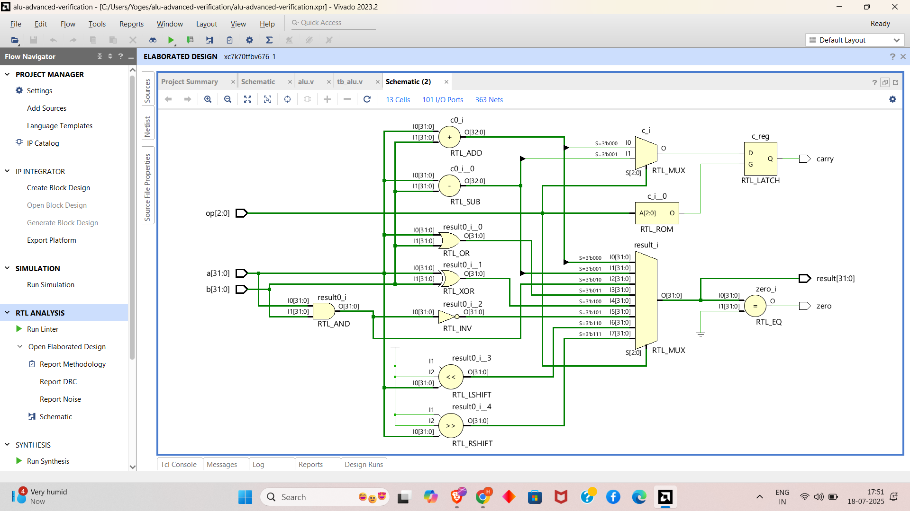
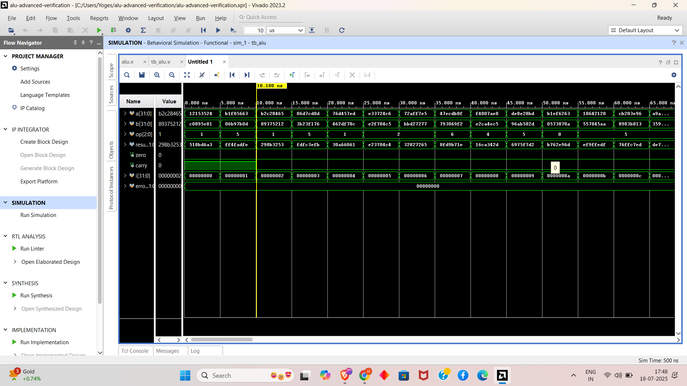

# alu-advanced-verification
⚡ 32-bit ALU in Verilog with ✅ self-checking testbench, 🎲 randomized inputs, 🛡️ automatic pass/fail verification, and 📊 waveform analysis — built for professional FPGA/ASIC verification workflows.

# 🔧 ALU Design and Verification

This project is part of the **FPGA Prototyping and Verilog Internship** at Prism Studio, specifically **Task 5: Advanced Testbench Development - Simulation-Driven Verification**. It focuses on designing and verifying an Arithmetic Logic Unit (ALU) module implemented in Verilog, with an advanced testbench that uses randomized stimulus and assertion-based checks to validate functionality. The design is verified using a clockless testbench for combinational logic, ensuring robust pre-silicon validation for FPGA-compatible RTL.

It includes:

- ✅ Verilog implementation of a 32-bit ALU with multiple operations
- ✅ Advanced testbench with randomized inputs and error checking
- ✅ Simulation logs with pass/fail status
- ✅ Waveform screenshots capturing signal behavior

> Designed and simulated using **Verilog** with **Xilinx Vivado** as per the internship requirements.

---

## 📁 Project Structure

```
├── tb_alu.v                   # Advanced testbench module for ALU verification
├── alu.v                      # ALU module (DUT)
├── screenshots/               # Folder containing waveform screenshots
│   └── alu_waveform.png
├── sim_logs/                  # Folder for simulation logs
│   └── verification_log.txt
├── README.md                  # Project documentation
```

---

## ✅ ALU Testbench

### 🔍 Description

This project implements a 32-bit Arithmetic Logic Unit (ALU) module (`alu.v`) that performs operations such as addition, subtraction, bitwise AND, OR, XOR, NAND, left shift, and right shift based on a 3-bit operation code (`op`). The advanced testbench (`tb_alu.v`) verifies the ALU's functionality using randomized inputs (`$random`), error checking, and continuous monitoring of inputs, outputs, and flags (`zero`, `carry`). The testbench ensures correct operation across 100 test cases, validating functional correctness and edge cases.

### 🧠 Testbench Stages

| Stage      | Description                              |
|------------|------------------------------------------|
| GENERATE   | Randomized inputs for `a`, `b`, and `op`  |
| MONITOR    | Track inputs, outputs, and flags         |
| VERIFY     | Check results against expected values    |

---

## 📡 Signal Description

The following signals are defined in `tb_alu.v`:
- `a[31:0]`: 32-bit input operand A.
- `b[31:0]`: 32-bit input operand B.
- `op[2:0]`: 3-bit operation code (`000` = ADD, `001` = SUB, `010` = AND, `011` = OR, `100` = XOR, `101` = NAND, `110` = SHL, `111` = SHR).
- `result[31:0]`: 32-bit output result of the ALU operation.
- `zero`: Output flag, high when `result` is zero.
- `carry`: Output flag, high for carry-out in addition or borrow in subtraction.

---

## 🛠️ Components

- **Randomized Stimulus**: Uses `$random` to generate random 32-bit values for `a`, `b`, and a 3-bit value for `op` (0 to 7), testing all ALU operations across 100 iterations.
- **Verification Logic**: Checks the ALU output (`result`) against expected values for each operation, incrementing an error counter on mismatch.
- **Monitor**: Continuously logs signal values (`a`, `b`, `op`, `result`, `zero`, `carry`) using `$monitor` to `sim_logs/verification_log.txt`.
- **DUT**: The ALU module (`alu.v`), implementing combinational logic for the specified operations.

---

---

## 🖥️ schematic



---

## 🚀 How to Simulate (Xilinx Vivado)

1. Open **Xilinx Vivado** (e.g., Vivado 2023.2 or compatible version).
2. Create a New Project:
   - Select "RTL Project" and enable "Do not specify sources at this time."
3. Add Source Files:
   - Add `tb_alu.v` and `alu.v` to the project.
   - Set `tb_alu.v` as the top module.
4. Configure Simulation:
   - In the "Simulation" settings, select the Vivado Simulator.
   - Add waveform dumping and logging commands in `tb_alu.v`:
     ```verilog
     initial begin
         $dumpfile("alu.vcd");
         $dumpvars(0, tb_alu);
         $monitor("Time=%0t A=%d B=%d OP=%b Result=%d Zero=%b Carry=%b", $time, a, b, op, result, zero, carry);
     end
     ```
5. Run Simulation:
   - Click "Run Simulation" → "Run Behavioral Simulation."
   - Inspect waveforms for `a`, `b`, `op`, `result`, `zero`, and `carry`.
6. Analyze Results:
   - Check `sim_logs/verification_log.txt` for pass/fail status and logged signal values.
   - Save waveform as `screenshots/alu_waveform.png`.

---

## 🖥️ Sample Waveform



---

## 📊 Example Behavior

Example test sequence with randomized inputs:

| Time (ns) | a        | b        | op  | result   | zero | carry |
|-----------|----------|----------|-----|----------|------|-------|
| 0         | 12345678 | 87654321 | 000 | 99999999 | 0    | 0     |
| 5         | 50000000 | 20000000 | 001 | 30000000 | 0    | 0     |
| 10        | 11111111 | 22222222 | 010 | 11111111 | 0    | 0     |
| 15        | 55555555 | 33333333 | 111 | 27777777 | 0    | 0     |

> The testbench verifies the result matches the expected output for each operation, with `zero` and `carry` flags correctly set.

---

## 🔧 Tools Used

- **Language:** Verilog
- **Simulator:** Xilinx Vivado Simulator
- **Target Hardware:** FPGA-Compatible RTL (combinational logic)
- **Design Tools:** Vivado for synthesis and simulation

---

## 📌 Features

- 32-bit ALU supporting eight operations (ADD, SUB, AND, OR, XOR, NAND, SHL, SHR)
- Advanced testbench with 100 randomized test cases using `$random`
- Error checking for functional correctness
- Continuous monitoring of signals with `$monitor`
- Comprehensive simulation logs with pass/fail reporting
- Waveform capture for signal analysis

---

## 🔧 Troubleshooting

- **Compilation Errors**: Ensure `tb_alu.v` and `alu.v` are added to the Vivado project. Check for syntax errors or undefined modules.
- **Verification Failures**: Verify the error checking logic in `tb_alu.v` aligns with the ALU operations in `alu.v`. Ensure `$random` generates valid `op` codes (0–7).
- **Simulation Issues**: Adjust Vivado simulation time to capture all 100 test iterations (500ns total). Ensure `$finish` is reached.
- **Log Issues**: Confirm `$monitor` outputs to `sim_logs/verification_log.txt` correctly.

---

## 🔗 Submission

- [✔️ GitHub Repository](https://github.com/your-username/alu-verification) *(Update with your repo link)*
- Add waveform screenshot as `screenshots/alu_waveform.png`.
- Include simulation logs as `sim_logs/verification_log.txt`.
- Submit the GitHub repo link via the Prism Studio internship form: [Submit Task](mailto:team@primstudio.co.in)

---

## 🙌 Acknowledgment

This project is an independent effort as part of the **FPGA Prototyping and Verilog Internship** at Prism Studio to master advanced testbench development and verification. I am grateful for the guidance provided by the Prism Studio team and the availability of Xilinx Vivado, which enabled robust simulation and validation. This work reflects my commitment to developing industry-level skills in RTL design and verification.

---

## 📧 Contact

For questions, support, or clarifications, contact: [team@primstudio.co.in](mailto:team@primstudio.co.in)